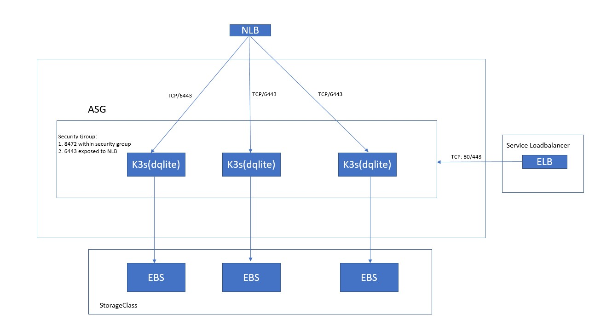

# Cloudformation script to bring HA k3s cluster on ec2

### Prerequisite

1. Go 1.13+
2. aws cli with credential configured
3. jq

### Run the script

`AWS_IAM_ARN=${your_iam_arn} ./k3s-ec2.up.sh`

This will bring up a cluster like 

